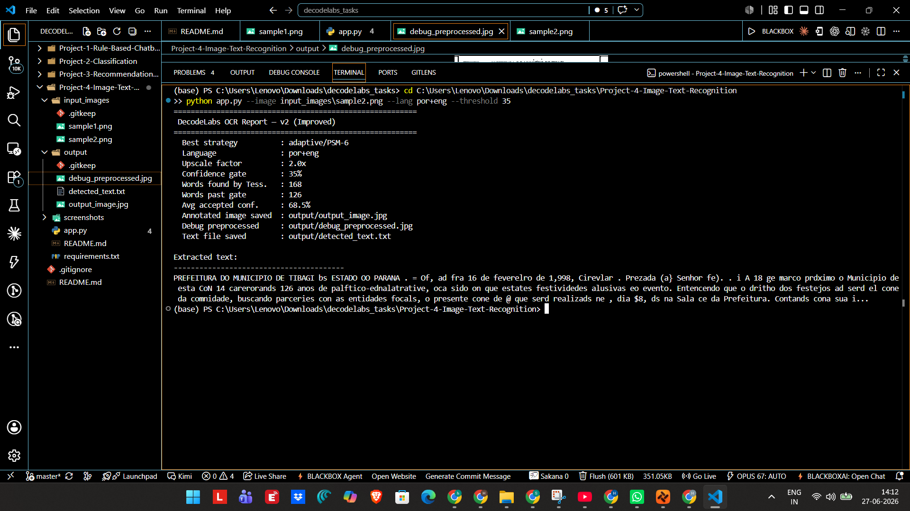

# Project 4 — Image / Text Recognition (Basic) — OCR Pipeline

## Overview
A basic computer-vision project that extracts machine-readable text from
images using Optical Character Recognition (OCR). It follows a full
pre-processing pipeline before recognition, and only accepts detections
that clear an 80% confidence gate — exactly as specified in the project
brief's "Gatekeeper Rule" for Milestone Validation.

## Objective
Implement an image/text recognition task using a pre-trained library,
run it on a sample input, and display the output clearly.

## Features
- Image pre-processing: Grayscale → Gaussian Blur → Adaptive (Otsu) Thresholding
- OCR via `pytesseract` (Google's Tesseract engine, configurable PSM mode)
- Per-word confidence scoring
- 80% confidence gate — low-confidence guesses are dropped, not shown
- Annotated output image with bounding boxes + confidence labels
- Extracted text saved to a `.txt` file

## Architecture

Image
|
v
Grayscale -> Gaussian Blur -> Adaptive Threshold (Otsu)
|
v
pytesseract OCR  (per-word text + confidence)
|
v
Confidence Gate (>= 80%)
|
v
Annotated Image (output_image.jpg) + Extracted Text (detected_text.txt)

## Tech Stack
Python, OpenCV, pytesseract, NumPy, Pillow

## Installation
1. Install the Tesseract OCR engine itself (a system binary, not just a pip package):
   - **Windows:** install from the [UB-Mannheim Tesseract build](https://github.com/UB-Mannheim/tesseract/wiki) and add it to PATH
   - **macOS:** `brew install tesseract`
   - **Linux (Debian/Ubuntu):** `sudo apt install tesseract-ocr`
2. Install Python dependencies:
```bash
   pip install -r requirements.txt
```

## Run
Place a real photo containing text in `input_images/` (a photo of a book
page, receipt, poster, or whiteboard works well), then run:
```bash
python app.py --image input_images/sample1.jpg
```

## Screenshots
> Replace this with a screenshot of your terminal output AND the
> generated `output/output_image.jpg`.



## Folder Structure

Project-4-Image-Text-Recognition/
│── app.py                # Main OCR pipeline
│── requirements.txt
│── input_images/         # Put your sample photo(s) here
│── output/               # detected_text.txt + output_image.jpg (auto-generated)
│── screenshots/
│── README.md

## Future Improvements
- Add the Path 2 (Object Detection) flow with OpenCV's `cv2.dnn` + MobileNet-SSD
- Multi-language OCR
- Real-time webcam OCR
- Handwriting recognition
